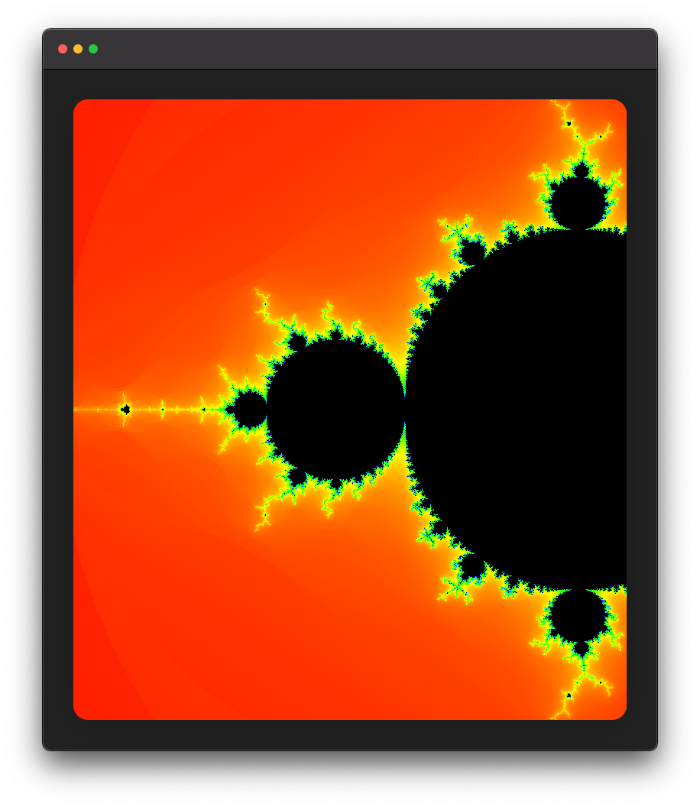

# JS Game of life

Typescript implementation of [Conway's Game of Life](https://en.wikipedia.org/wiki/Conway%27s_Game_of_Life).

    

        
		&nbsp;&nbsp;&nbsp;
        
    

	<a href="https://leandrosq.github.io/js-game-of-life/">Live demo here</a>

## About

This project was a simple way to get trough some hours without internet, while my connection was down for a couple of hours. I have fixed the FPS to 15, because it looks better, too many FPS will be confusing and disorienting.

## Features

- Light and Dark mode
- Mobile support
- Typescript

## Project

| Name | Description |
| -- | -- |
| Eslint | For linting and semantic analysis |
| Prettier | For code formatting |
| Browser sync | For live reloading |
| Github actions | For CI, building and deploying to github pages |
| [Google fonts](https://fonts.google.com/) | For the [Rubik](https://fonts.google.com/specimen/Rubik) font |
| FontAwesome | For the [favicon](https://fontawesome.com/icons/robot?s=solid&f=classic) |
