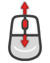
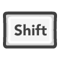

# Mandelbrot Web

A mandelbrot set renderer in the browser, comparing the performance of: `WebGPU`, `WebGL`, `HTML Canvas`, `WASM` and `HTML Canvas + MathJS`.

    

        
    

	<a href="https://leandrosq.github.io/js-mandelbrot/">Live demo here</a>

## About

This is but an experiment to compare the performance of different technologies in the browser, the goal is to render the mandelbrot set in real time, and to be able to zoom and pan around with minimal latency.

The following technologies are used to render:
- [WebGPU](https://gpuweb.github.io/gpuweb/)
- [WebGL](https://www.khronos.org/webgl/)
- [Canvas with raw ImageData manipulation](https://developer.mozilla.org/en-US/docs/Web/API/Canvas_API)
- [WASM](https://webassembly.org/)
- [Canvas with raw ImageData manipulation + MathJS](https://mathjs.org/)

The only target not widely supported is WebGPU, you can check the support [here](https://caniuse.com/webgpu).

> **Note 1:** I initially also made a renderer using plain Canvas API's, but since `fillRect` for each pixel is too slow, I decided to remove it from the comparison.

> **Note 2:** For the WASM renderer, I used [AssemblyScript](https://www.assemblyscript.org/) to compile the code to WASM, and [esbuild](https://esbuild.github.io/) to bundle it. For some reason it is slower than the pure JS version, I'm not sure why, but I suspect it has something to do with the way I'm passing the data to the WASM module.

> **Note 3:** For the Canvas + MathJS renderer, I used [MathJS](https://mathjs.org/) to do the calculations, and then I used the Canvas API to render the pixels. It is the slowest of all, but it is also the most accurate, since it uses arbitrary precision numbers.

> **Note 4:** For WebGL, WebGPU and WASM I used 32 float numbers, which are easily changed to 64 float numbers, except on WebGPU where there is no support. This yields a accurate enough result, but does not allow for deep zooms.

## Controls

### Desktop:

>  +  to zoom in/out

>  to vertical pan

>  +  to horizontal pan

> Mouse secondary wheel to horizontal pan (Like the one in Logitech MxMaster3)

> / to drag to pan

>  to toggle fullscreen
### Laptop:

>  Trackpad Pinch zoom in/out

> / Trackpad vertical pan

> / Trackpad horizontal pan

>  Trackpad double tap to toggle fullscreen
### Touch/Mobile:

>  Pinch zoom in/out

> /// Drag to pan

>  Double tap to toggle fullscreen

## Project
### Resources
| Name | Description |
| -- | -- |
| Eslint | For linting and semantic analysis |
| Prettier | For code formatting |
| Typescript | For static typing |
| AssemblyScript | For WASM |
| esbuild | For bundling |
| gulp | For task automation |
| SASS | For CSS preprocessing |
| EJS | For HTML templating |
| [ThoseAwesomeGuys Prompts](https://thoseawesomeguys.com/prompts) | For the Keyboard and gesture icons |
| Browser sync | For live reloading |
| Github actions | For CI, building and deploying to github pages |
| [Google fonts](https://fonts.google.com/) | For the [Rubik](https://fonts.google.com/specimen/Rubik) font |
| FontAwesome | For the [favicon](https://fontawesome.com/icons/robot?s=solid&f=classic) |

### Devices used for testing

- iPhone 13 Pro
- ROG Ally
- Macbook M1 Pro 14" 2021
- Mi Pad 5 Pro
- Windows Desktop

### Browsers tested

- Safari - iOS
- Safari - MacOS
- Chrome - iOS
- Chrome - MacOS
- Chrome - Android
- Edge - MacOS
- Edge - Windows